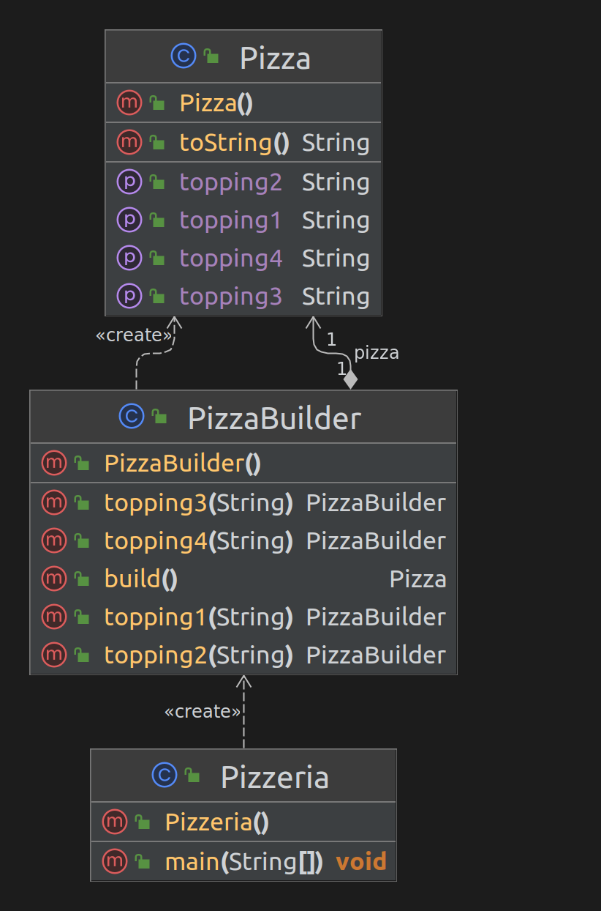

### Шаблон:

Строитель (Builder)

----------------------------------------------------------------------------------------------------------------------
### Цель:

Отделить конструирование сложного объекта от его представления таким образом, чтобы в результате
одного и того же мы могли получать разные представления

----------------------------------------------------------------------------------------------------------------------
### Для чего используется:

Для создания различных объектов из одного набора данных

----------------------------------------------------------------------------------------------------------------------
### Пример использования:

- порядок создания сложного объекта не должен зависеть от того, из каких частей состоит объект 
и их взаимосвязей;
- процесс конструирования объекта должен представлять различные представления объекта, который
мы конструируем.

----------------------------------------------------------------------------------------------------------------------
### Диаграмма

----------------------------------------------------------------------------------------------------------------------