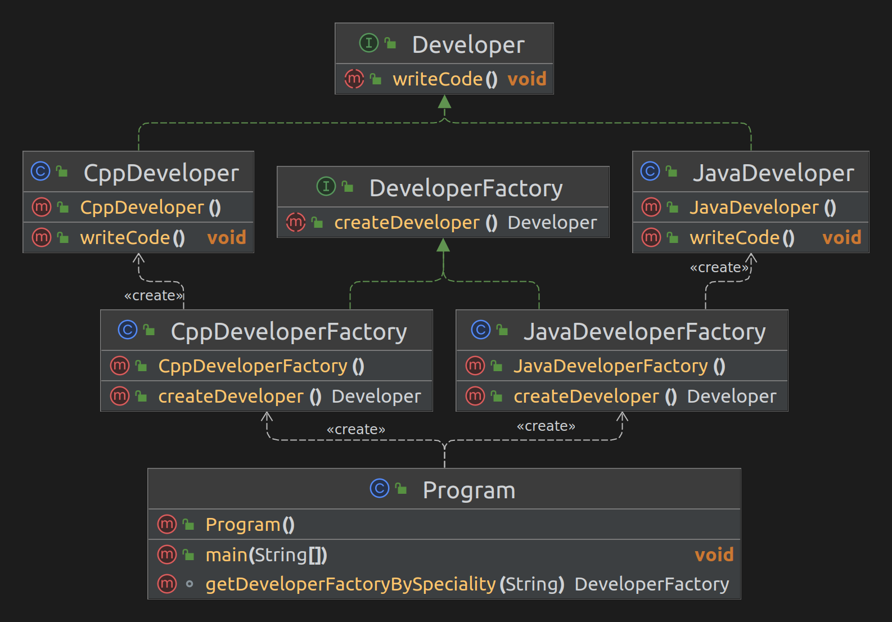

### Шаблон:

Фабрика (Factory method)

----------------------------------------------------------------------------------------------------------------------
### Цель:

Создание интерфейса, который создает объект. При этом выбор того, экземпляр какого класса создавать, остается за
классами, которые реализуют этот интерфейс.

----------------------------------------------------------------------------------------------------------------------
### Для чего используется:

Для делегирования создания экземпляров классов другому классу

----------------------------------------------------------------------------------------------------------------------
### Пример использования:

- заранее не известно, экземпляр какого класса нужно создавать;
- класс спроектирован таким образом, что создаваемые им объекты имеют свойства определенного класса

----------------------------------------------------------------------------------------------------------------------
### Диаграма

----------------------------------------------------------------------------------------------------------------------